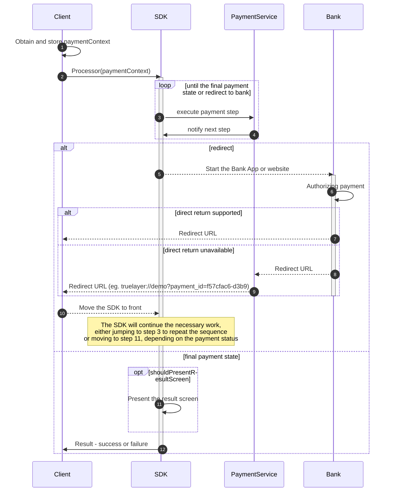

# Version 3.8.0 Changes

## Table of contents

<!-- TOC -->
* [Version 3.8.0 Changes](#version-380-changes)
  * [Table of contents](#table-of-contents)
  * [New Features](#new-features)
  * [Underlying library updates](#underlying-library-updates)
  * [Known Issues](#known-issues)
  * [Breaking Changes](#breaking-changes)
  * [The updated payment flow diagram](#the-updated-payment-flow-diagram)
    * [Integration steps - the diagram explained](#integration-steps---the-diagram-explained)
    * [ReactNative integration problems](#reactnative-integration-problems)
* [Processing payment step by step](#processing-payment-step-by-step)
  * [Step 1: Install the SDK](#step-1-install-the-sdk)
    * [Core Library Desugaring](#core-library-desugaring)
  * [Step 2: Initialise the SDK](#step-2-initialise-the-sdk)
    * [If you are using AppStartup](#if-you-are-using-appstartup)
  * [Step 3: Process a payment](#step-3-process-a-payment)
    * [Option 1: Process a payment with an AndroidX Activity integration](#option-1-process-a-payment-with-an-androidx-activity-integration)
    * [Option 2: Process a payment with an Android Activity integration](#option-2-process-a-payment-with-an-android-activity-integration)
    * [Option 3: Process a payment with a Jetpack Compose integration](#option-3-process-a-payment-with-a-jetpack-compose-integration)
  * [Step 4: Handle redirects from the bank](#step-4-handle-redirects-from-the-bank)
  * [Step 5: Displaying the payment result](#step-5-displaying-the-payment-result)
  * [Step 6: Handle final result](#step-6-handle-final-result)
* [Processor Results - Success or Error](#processor-results---success-or-error)
  * [Error](#error)
  * [Success](#success)
<!-- TOC -->

## New Features

The SDK is no longer sending `success` message with reason `redirect`. This is to make the SDK result
more useful for the client app. The `succeess/redirect` message was most of the time just ignored.

Another, most important reason, is the ability for the user to retry the redirect to the bank app.
This is useful in, not so uncommon, case when the bank app will not produce correct screen. The user
now will have possibility to get back to merchant app and click the `go to bank` button again.

This change have a chance of reducing the number of abandoned/timed-out payments.

Now the SDK will refresh payment state at any point when user will switch back to the merchant app.
This will also be helpful in the situation when the redirect back from the bank will fail for any reason.
When user will get back to the app, the SDK will fetch the latest payment status and will act
accordingly.

## Underlying library updates

- `kotlin` : `1.9.25`
- `gradle-version` : `8.7.0`
- `com.android.tools.build:gradle` : `8.7.0`
- `compose-bom` : `2024.09.02`
- `org.jetbrains.kotlinx.kotlinx-coroutines-core` : `1.9.0`
- `androidx.fragment.fragment-ktx` : `1.8.4`
- `androidx.navigation.navigation-compose` : `2.8.2`
- `androidx.startup.startup-runtime` : `1.2.0`
- `androidx.lifecycle.lifecycle-runtime-compose-android` : `2.8.6`

## Known Issues

With the `compose-bom` : `2024.09.03` there is a change of `focusable` attribute in the `TextField` and `OutlinedTextField`.
This is causing lack of automatic hiding the keyboard when the user clicks `done` IME button on the keyboard. The keyboard
can still be hidden by click hide keyboard button on the keyboard itself.
This is only affecting some EUR payments.


## Breaking Changes

The SDK will no longer send `success` message with reason `redirect`.
The implication is that the SDK will not be dismissed after the redirect to the bank app.
The SDK screen has to be brought back to the front when redirect back from the bank app.

The SDK will now only return with the one of the final statuses for the payment:
`failed`, `cancelled`, `executed`, `settled`, `authorized`

The following change will have to be made in the client app:

> :warning: </br>
> For the non-Compose integrations Activity that starts the SDK should be `android:launchMode="standard"`. 
> This is to make sure that the SDK Activity is not recreated when the redirect back
from the bank app happens. This is important so that the result screen is not shown multiple times.
> 
> Please take a look at the demo code how to handle the redirect back from bank.
 
 ## The updated payment flow diagram



### Integration steps - the diagram explained

1. (1)The Merchant app needs to create a payment.
2. (2)Once the payment is created, The Merchant app needs to launch the SDK with the paymentContext.
3. (3,4)The SDK will execute appropriate steps.

Now there are 2 possibilities for the flow to continue:
- (5, 6)For UK and some EU banks: the SDK will redirect user to their bank and notify result of (`success`, `redirect`)
- (11, 12)For some EU banks: SDK will just complete entire payment journey. In the end it will return result to the Merchant app. 

With the possibility #1 the following steps will happen.
4. (8 or 9,10)The Bank will redirect back to the Merchant App.
5. (2) The Merchant app needs to invoke the SDK again.
6. (11, 12) The SDK will optionally present the result screen and then return result to the Merchant App.

At the redirect step there is no need for the Merchant App to check the status of the payment. The SDK will handle
all relevant statuses and act accordingly.
Starting the SDK only when the payment is in the `AuthorizationRequired` status is not sufficient as the status `Authorizing`
also requires SDK to be launched.

### ReactNative integration problems

We have observed that there is a problem with React Native library that handles redirects. Quite often 
developers registering the event listener multiple times, without realizing it. Then the redirect event
is triggered multiple times (once per each listener).

To prevent SDK being launched multiple times we propose the following solution:

```typescript jsx

    // Make sure you will subscribe to the event listener only once
    // by checking the listenerCount.
    if (Linking.listenerCount("url") == 0) {
        Linking.addEventListener("url", (event) => {
            console.log("eventListener url: " + event.url)
            handleRedirect(event.url)
        })
    }

```

# Processing payment step by step

## Step 1: Install the SDK
Before you add the SDK to our project, make sure that your `build.gradle` configuration is configured to support `minSdk` 24 (Android 7.0) or higher as well the `packagingOptions` below:

### Core Library Desugaring
In order to be able to run on API level below 26 the SDK requires your application to have core library desugaring enabled. Without this the SDK will crash.

```groovy
android {
    defaultConfig {
        applicationId "com.example.myapp"
        minSdk 24 // Sdk 24 or higher supported
    }

    compileOptions {
        coreLibraryDesugaringEnabled true
    }
    
    packagingOptions {
        resources {
            pickFirsts += ['META-INF/LICENSE-MIT']
        }
    }
}
```

To add the SDK to your project, simply include TrueLayer Payments SDK to your dependencies.

```groovy
coreLibraryDesugaring "com.android.tools:desugar_jdk_libs:2.0.4"
// Add to your projects `build.gradle`.
implementation "com.truelayer.payments:ui:3.1.0"
```

## Step 2: Initialise the SDK

To use the SDK, you have to first initialise it before invoking any other SDK method. The following code sample is an example of initialising the SDK:

```kotlin
import com.truelayer.payments.core.domain.configuration.Environment
import com.truelayer.payments.core.domain.configuration.HttpConnectionConfiguration
import com.truelayer.payments.core.domain.configuration.HttpLoggingLevel
import com.truelayer.payments.ui.TrueLayerUI

// Initialize the SDK with your application context.
TrueLayerUI.init(context = applicationContext) {
    // optionally choose which environment you want to use: PRODUCTION or SANDBOX
    environment = Environment.PRODUCTION
    // Make your own custom http configuration, stating custom timeout and http request logging level
    httpConnection = HttpConnectionConfiguration(
        timeoutMs = 45000,
        httpDebugLoggingLevel = HttpLoggingLevel.None
    )
}
```

### If you are using AppStartup

If you are using [AppStartup](https://developer.android.com/topic/libraries/app-startup) you will need to add WorkManagerInitializer to list of your dependencies:
```kotlin
import androidx.work.WorkManagerInitializer
(...)
override fun dependencies(): List<Class<out Initializer<*>>> {
    return listOf(WorkManagerInitializer::class.java)
}
```

## Step 3: Process a payment

Depending on your preferred approach, you can choose to integrate the SDK into your payment process with either **AndroidX Activity**, with the old-fashioned **Android Activity** or with **Jetpack Compose**.

In both cases, you'll need the `id` and the `resourceToken` obtained from the backend. The fields mentioned earlier will be passed to the SDK via `PaymentContext` or `MandateContext`. There is little more to know about this object. Here is the `kdoc` that explains all available parameters

```kotlin
/**
 * ProcessorContext to identify payment or mandate to be processed
 * [Payment API](https://docs.trulayer.com/)
 *
 * @property id payment or mandate identifier obtained from
 *                     create payment API [crate payment API](https://docs.truelayer.com/reference/create-payment)
 *                     or create mandate API [crate payment API](https://docs.truelayer.com/reference/create-mandate)
 * @property resourceToken resource token obtained from
 *                     create payment API [crate payment API](https://docs.truelayer.com/reference/create-payment)
 *                     or create mandate API [crate payment API](https://docs.truelayer.com/reference/create-mandate)
 * @property redirectUri uri that will be invoked once payment authorization is completed
 */
@Parcelize
sealed class ProcessorContext : Parcelable {
    abstract val id: String
    abstract val resourceToken: String
    abstract val redirectUri: String

    /**
     * PaymentContext to identify payment to be processed
     * [Payment API](https://docs.trulayer.com/)
     *
     * @property id payment identifier obtained from
     *                     create payment API [crate payment API](https://docs.truelayer.com/reference/create-payment)
     * @property resourceToken resource token obtained from
     *                     create payment API [crate payment API](https://docs.truelayer.com/reference/create-payment)
     * @property redirectUri uri that will be invoked once payment authorization is completed
     * @property preferences object containing various preferences that allow to override default SDK
     *                     behaviour in certain aspects.
     */
    @Parcelize
    data class PaymentContext(
        override val id: String,
        override val resourceToken: String,
        override val redirectUri: String,
        val preferences: PaymentPreferences? = null
    ) : ProcessorContext()

    /**
     * MandateContext to identify mandate to be processed
     * [Payment API](https://docs.trulayer.com/)
     *
     * @property id mandate identifier obtained from
     *                     create mandate API [crate payment API](https://docs.truelayer.com/reference/create-mandate)
     * @property resourceToken resource token obtained from
     *                     create mandate API [crate payment API](https://docs.truelayer.com/reference/create-mandate)
     * @property redirectUri uri that will be invoked once payment authorization is completed
     * @property preferences object containing various preferences that allow to override default SDK
     *                     behaviour in certain aspects.
     */
    @Parcelize
    data class MandateContext(
        override val id: String,
        override val resourceToken: String,
        override val redirectUri: String,
        val preferences: MandatePreferences? = null
    ) : ProcessorContext()

    /**
     * Preferences class that allows to set preferences and override default SDK behaviour
     * in certain aspects.
     *
     * @property preferredCountryCode (optional) in case there are available payment providers from
     *                      multiple countries the SDK will try select most appropriate one automatically.
     *                      You may want to override that behaviour.
     *                      By setting the preferredCountryCode (ISO 3166-1 alpha-2, example: "GB" or "FR"),
     *                      the SDK will try first to select preferred country before falling back to the
     *                      auto selection.
     * @property shouldPresentResultScreen (optional) true if the result screen should be presented
     *                      before the final redirect to the merchant app. Default is true.
     * @property waitTimeMillis the total time the result screen will wait to get a final status of the payment
     *                      Default is 3 seconds. Minimum is 2 seconds. Maximum is 10 seconds.
     */
    @Parcelize
    data class PaymentPreferences(
        val preferredCountryCode: String? = null,
        val shouldPresentResultScreen: Boolean = true,
        val waitTimeMillis: Long = 3_000
    ) : Parcelable {
        internal fun intoInternalPreferences() =
            com.truelayer.payments.ui.models.PaymentContext.Preferences(
                preferredCountryCode = preferredCountryCode,
                shouldPresentResultScreen = shouldPresentResultScreen
            )
    }

    /**
     * Preferences class that allows to set preferences and override default SDK behaviour
     * in certain aspects.
     *
     * @property preferredCountryCode (optional) in case there are available mandate providers from
     *                      multiple countries the SDK will try select most appropriate one automatically.
     *                      You may want to override that behaviour.
     *                      By setting the preferredCountryCode (ISO 3166-1 alpha-2, example: "GB" or "FR"),
     *                      the SDK will try first to select preferred country before falling back to the
     *                      auto selection.
     * @property shouldPresentResultScreen (optional) true if the result screen should be presented
     *                      before the final redirect to the merchant app. Default is true.
     * @property waitTimeMillis the total time the result screen will wait to get a final status of the payment
     *                      Default is 3 seconds. Minimum is 2 seconds. Maximum is 10 seconds.
     */
    @Parcelize
    data class MandatePreferences(
        val preferredCountryCode: String? = null,
        val shouldPresentResultScreen: Boolean = true,
        val waitTimeMillis: Long = 3_000
    ) : Parcelable {
        internal fun intoInternalPreferences() =
            com.truelayer.payments.ui.models.PaymentContext.Preferences(
                preferredCountryCode = preferredCountryCode,
                shouldPresentResultScreen = shouldPresentResultScreen
            )
    }
}
```

### Option 1: Process a payment with an AndroidX Activity integration

```kotlin
import android.content.Intent
import android.os.Bundle
import android.widget.Toast
import androidx.activity.result.ActivityResultLauncher
import androidx.appcompat.app.AppCompatActivity
import androidx.core.util.Consumer
import com.truelayer.payments.core.domain.configuration.HttpConnectionConfiguration
import com.truelayer.payments.core.domain.configuration.HttpLoggingLevel
import com.truelayer.payments.core.domain.utils.Fail
import com.truelayer.payments.core.domain.utils.Ok
import com.truelayer.payments.core.utils.extractTrueLayerRedirectParams
import com.truelayer.payments.ui.TrueLayerUI
import com.truelayer.payments.ui.screens.processor.ProcessorActivityContract
import com.truelayer.payments.ui.screens.processor.ProcessorContext
import com.truelayer.payments.ui.screens.processor.ProcessorResult

class ActivityXIntegrationActivity : AppCompatActivity() {
  
    override fun onCreate(savedInstanceState: Bundle?) {
        super.onCreate(savedInstanceState)
      
        initializeSdk()
      
        val flow = registerFlow()
        // here try to handle the redirect from bank intent
        // if this activity is just started not as a redirect result
        // then the following function should do nothing
        tryHandleIntentWithRedirectFromBankData(intent, flow)
      
        startPaymentButton.setOnClickListener {
            startPayment(flow)
        }
    }
  
    fun initializeSdk() {
      // Initialize the SDK with your application context.
      TrueLayerUI.init(context = applicationContext) {
        // optionally choose which environment you want to use: PRODUCTION or SANDBOX
        environment = Environment.PRODUCTION
        // Make your own custom http configuration, stating custom timeout and http request logging level
        httpConnection = HttpConnectionConfiguration(
          timeoutMs = 30_000,
          httpDebugLoggingLevel = HttpLoggingLevel.None
        )
      }
    }
  
    /**
     * This function will only execute flow if the start intent
     * contains correct payment or mandate ID and if the corresponding
     * context for the payment or mandate is available
     */
    fun tryHandleIntentWithRedirectFromBankData(
        intent: Intent,
        flow: ActivityResultLauncher<ProcessorContext>
    ) {
        val params = intent.data.extractTrueLayerRedirectParams()
        // restore previously stored payment context
        // that matches the ID from the redirect url
        val storedProcessorContext = LocalStore.getStoredPaymentContext()
        if (params.isNotEmpty() && storedProcessorContext != null &&
            (storedProcessorContext.id == params["payment_id"] || storedProcessorContext.id == params["mandate_id"])
        ) {
            // The user is returning from the provider app
            // and the payment/mandate ID matches the one we have stored
            // so we can fetch the payment status
            flow.launch(storedProcessorContext)
        }
    }

    fun registerFlow(): ActivityResultLauncher<ProcessorContext> {
        // Register for the end result.
        val contract = ProcessorActivityContract()
        return registerForActivityResult(contract) {
            val text = when (it) {
                is ProcessorResult.Failure -> {
                    "Failure ${it.reason}, ${it.resultShown}"
                }
                is ProcessorResult.Successful -> {
                    "Successful ${it.step}, ${it.resultShown}"
                }
            }
            // present the final result
            Toast.makeText(this, text, Toast.LENGTH_LONG).show()
        }
    }

    fun startPayment(flow: ActivityResultLauncher<ProcessorContext>) {
        // Obtain your payment context from your backend
        val paymentContext = PaymentContext(
            id = "your-payment-identifier",
            resourceToken = "payment-resource-token",
            redirectUri = "redirect-uri-that-will-be-invoked-when-coming-back-from-bank"
        )
        // store the payment context as it will be needed when you will be handling redirect back from bank 
        LocalStore.storePaymentContext(paymentContext)
        // 🚀 Launch the payment flow.
        processorResult.launch(paymentContext)
    }
}
```

### Option 2: Process a payment with an Android Activity integration

```kotlin
import android.app.Activity
import android.content.Intent
import android.os.Bundle
import android.widget.Toast
import com.truelayer.payments.core.domain.configuration.Environment
import com.truelayer.payments.ui.TrueLayerUI
import com.truelayer.payments.ui.screens.processor.ProcessorContext.PaymentContext
import com.truelayer.payments.ui.screens.processor.ProcessorActivityContract
import com.truelayer.payments.ui.screens.processor.ProcessorResult

class ActivityIntegration : Activity() {
    override fun onCreate(savedInstanceState: Bundle?) {
        super.onCreate(savedInstanceState)

        initializeSdk()
      
        tryHandleIntentWithRedirectFromBankData(intent)

        startPaymentButton.setOnClickListener {
          startPayment()
        }
    }

    fun initializeSdk() {
      // Initialize the SDK with your application context.
      TrueLayerUI.init(context = applicationContext) {
        // optionally choose which environment you want to use: PRODUCTION or SANDBOX
        environment = Environment.PRODUCTION
        // Make your own custom http configuration, stating custom timeout and http request logging level
        httpConnection = HttpConnectionConfiguration(
          timeoutMs = 30_000,
          httpDebugLoggingLevel = HttpLoggingLevel.None
        )
      }
    }

    /**
     * This function will only execute flow if the start intent
     * contains correct payment or mandate ID and if the corresponding
     * context for the payment or mandate is available
     */
    fun tryHandleIntentWithRedirectFromBankData(
      intent: Intent
    ) {
      val params = intent.data.extractTrueLayerRedirectParams()
      // restore previously stored payment context
      // that matches the ID from the redirect url
      val storedProcessorContext = LocalStore.getStoredPaymentContext()
      if (params.isNotEmpty() && storedProcessorContext != null &&
        (storedProcessorContext.id == params["payment_id"] || storedProcessorContext.id == params["mandate_id"])
      ) {
        // The user is returning from the provider app
        // and the payment/mandate ID matches the one we have stored
        // so we can fetch the payment status
        startPaymentProcessorActivity(storedProcessorContext)
      }
    }

    private fun startPaymentProcessorActivity(processorContext: ProcessorContext) {
      // Create an intent with the payment context to start the payment flow
      val intent = ProcessorActivityContract().createIntent(this, processorContext)
      // Start activity for result to receive the results of the payment flow
      startActivityForResult(intent, 0)
    }

    fun startPayment() {
      // Obtain your payment context from your backend
      val paymentContext = PaymentContext(
        id = "your-payment-identifier",
        resourceToken = "payment-resource-token",
        redirectUri = "redirect-uri-that-will-be-invoked-when-coming-back-from-bank"
      )
      // store the payment context as it will be needed when you will be handling redirect back from bank 
      LocalStore.storePaymentContext(paymentContext)
      // 🚀 Launch the payment flow.
      startPaymentProcessorActivity(paymentContext)
    }

    override fun onActivityResult(requestCode: Int, resultCode: Int, data: Intent?) {
        super.onActivityResult(requestCode, resultCode, data)
        // Act on the SDK result
        val text = when (val result = ProcessorResult.unwrapResult(data)) {
            is ProcessorResult.Failure -> "Failure ${result.reason}"
            is ProcessorResult.Successful -> "Successful ${result.step}"
            null -> "Activity result failed."
        }
        Toast.makeText(this, text, Toast.LENGTH_LONG).show()
    }
}
```

### Option 3: Process a payment with a Jetpack Compose integration

The following example shows how to process a payment with a Jetpack Compose integration:

```kotlin
// Your payments custom theme or use the provided defaults as below
val theme = TrueLayerTheme(
    lightPalette = LightColorDefaults,
    darkPalette = DarkColorDefaults,
    typography = TypographyDefaults
)

// Obtain your payment context from your backend
val paymentContext = PaymentContext(
    id =  "your-payment-identifier",
    resourceToken = "payment-resource-token",
    redirectUri = "redirect-uri-that-will-be-invoked-when-coming-back-from-bank"
)

setContent {
    Theme(
        theme = theme
    ) {
        Processor(
            context = paymentContext,
            onSuccess = { successStep ->
                // action on success
            },
            onFailure = { failureReason ->
                // action on failure
            },
        )
    }
}
```
## Step 4: Handle redirects from the bank

There are banks that do require more than one redirect to complete the payment.

Once the redirect will reach your application you need to relaunch the SDK with the same `PaymentContext` or `MandateContext` that the corresponding payment was started with. The SDK will inspect the state of the payment and will act accordingly.

More information on how to do it can be found in section [Handle redirects](#handle-redirects-from-the-bank).

## Step 5: Displaying the payment result
The SDK provides a screen that can be used to display the result of a processed payment to the user.
If you don't want to use that screen you need to opt-out by setting a `shouldPresentResultScreen = false` on the `PaymentPreferences` or `MandatePreferences`.

## Step 6: Handle final result

Handle the [processor result](#processor-results---success-or-error) returned by the SDK in your app.

# Processor Results - Success or Error

Regardless of the integration route you are going to select in the end you will be presented with a result. It can be `success` or `error`.

## Error
In case of error you will have a failure reason. It will be one of the following:

- `NoInternet` There was a problem connecting to the internet. Most likely when the user is not connected to the internet. It can also be caused by a network configuration, if no route to TrueLayer services can be established.
- `UserAborted` When the user purposefully aborted the payment process.
- `UserAbortedProviderTemporarilyUnavailable` When user aborted payment process because preselected provider was temporarily unavailable.
- `UserAbortedFailedToNotifyBackend` User aborted but the application failed to notify the backend, or the backend responded with an error. In rare cases user may try to cancel the payment process after the payment has been authorized/completed. Please check the status of the payment at the backend when you see this error.
- `UserAbortedProviderTemporarilyUnavailableFailedToNotifyBackend` When user aborted payment process because preselected provider was temporarily unavailable but application failed to notify backend or backend responded with an error.
- `CommunicationIssue` Communication issue. When something goes wrong with the communication with the backend. It may be an invalid payment token, or just the payment service responding in unexpected manner.
- `ConnectionSecurityIssue` This will be returned when secure a connection to payment services could not be established.
- `PaymentFailed` When the payment is in failed state. A recovery from this state is not possible.
- `WaitAbandoned` The user purposefully abandoned the payment flow at the point when the flow was awaiting authorization from the bank. The authorization from the bank may or may not depend on a user action, and the payment may still complete.
- `WaitTokenExpired` The authorization waiting time was so long that the resource token has expired. We are no longer able to query the payment status.
- `ProcessorContextNotAvailable` A technical failure. It was not possible to read the `ProcessorContext` in which you've set the payment/mandate id and `resource_token`. If you see this error, check that you're following the steps in this guide correctly, or raise a support ticket with us if you need further help.
- `InvalidResource` When an unsupported resource is used to launch the result screen. This is in case the SDK would be used to process payment of a preauthorized mandate, which should be happening as a backend to backend process.
- `Unknown` The SDK was unable to identify a reason for the failure.

## Success

When a success result is presented, it means that the SDK has completed its role in initiating the payment. However, it doesn't necessarily mean that the payment itself is complete. To help understand the context in which the SDK completes its task, it also provides the step at which the flow completed:

- **(Removed in 3.8.0)** `Redirect` When the user was redirected to their bank to authorize the payment.
- `Wait` When the SDK flow is complete, but a decoupled authorisation action is still pending with the user and/or the bank.
- `Authorized` When the user authorized the payment with the bank.
- `Successful` When the bank has confirmed that they have accepted the payment request, and they intend to execute it.
- `Settled` When the funds have reached the destination.

Before acting on the result of the SDK completing its process, it's important to understand [the status of the payment](https://docs.truelayer.com/docs/payment-statuses-for-payments-v3) or [mandate](https://docs.truelayer.com/docs/mandate-statuses).
