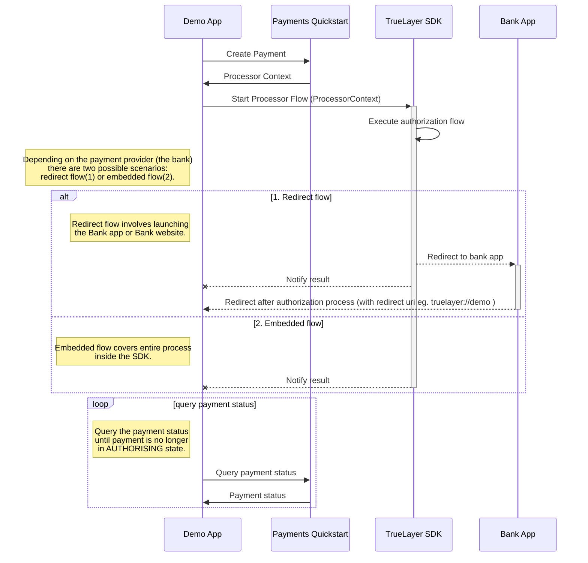

<p align="center">
    
</p>

<br>  

# TrueLayer Android SDK Demo
This project provides examples for integrating the TrueLayer Android SDK. Check out the [integration guide](https://docs.truelayer.com/docs/android-sdk-for-payments-v3) for more details.

## Before you begin
Register `truelayer://demo` as a `redirect_uri` in your [developer console](https://console.truelayer.com). This is used at the end of the payment journey to redirect back to this app.
> You may register a different scheme but then you need to modify the `Manifest` file and `ProcessorContextProvider.redirectUri` property.

## API Setup
This app uses our [Payments Quickstart API](https://github.com/TrueLayer/payments-quickstart) to simplify the process of creating payments 
and retrieving their status. You will need to setup your own installation of this project to use this app.
Payments Quickstart is a project that will allow you to instantly get up to speed with SDK integration without a need for your own backend to be ready.

>Beware this project is meant to be used for testing only, and the functionality behind (or at least part of it) will need to be implemented on your own backend service.

## Configuration
<p align="center">
    
</p>
The app allows you to configure your use of the Payments Quickstart API within the app. Simply add the URI to the API in the field on the app's main screen and select
your environment from the dropdown.

You can also select between launching flows for payments in different currencies or mandates.

 
## :warning: **For SDK version 3.8.0+ go [here](./MigrateTo3.8.0.md)** :warning:

## Version 3.9.0

Introduction of AIS+PIS flow for EUR payments. This allows users to select their account instead of typing in the IBAN.

This version is set to use:
- `kotlin` : `1.9.25`
- `compose-bom` : `2024.11.00`
- `desugaring` : `2.1.3`
- `com.android.tools.build:gradle` : `8.7.0`
- `gradle-8.9`
- `targetSDK`: `35`
- `jvmTarget`: `19`
- `javaVersion`: `JavaVersion.VERSION_19`

## Version 3.9.1

The Java version has been downgraded from 19 to 17 to allow more flexibility for integrators.
```
jvmTarget = 17 
sourceCompatibility = JavaVersion.VERSION_17 
targetCompatibility = JavaVersion.VERSION_17
```

## How does the payment flow with the SDK works?


