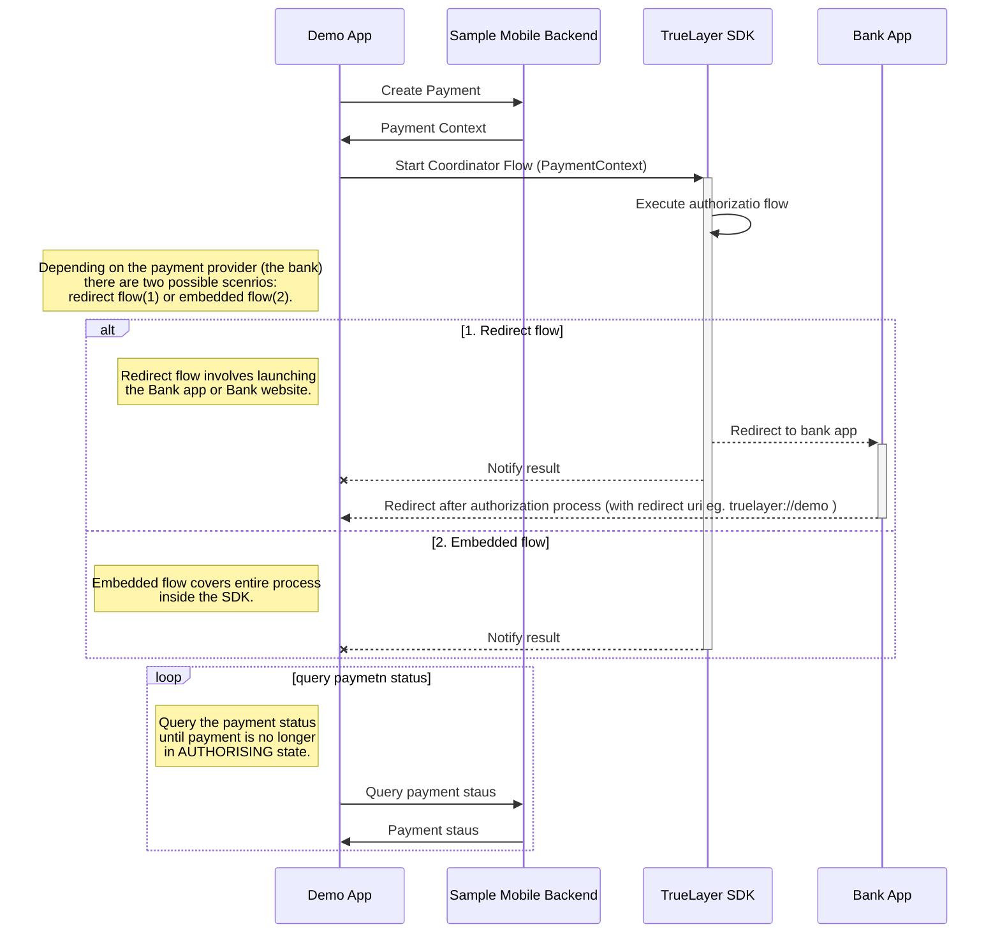

<p align="center">
    
</p>

<br>  

# TrueLayer Android SDK Demo
This project provides examples for integrating the [TrueLayer Android SDK](https://github.com/TrueLayer/truelayer-android-sdk).

## Before you begin
Register `truelayer://demo` as a `redirect_uri` in your [developer console](https://console.truelayer.com). This is used at the end of the payment journey to redirect back to this app.
> You may register a different scheme but then you need to modify the `Manifest` file and `PaymentContextProvider.redirectUri` property.

## API Setup
This app uses our [Example Backend API](https://github.com/TrueLayer/example-mobile-backend) to simplify the process of creating payments 
and retrieving their status. You will need to setup your own installation of this project to use this app. 
Example Mobile Backend is a project that will allow you to instantly get up to speed with SDK integration without a need for your own backend to be ready.

>Beware this project is meant to be used for testing only, and the functionality behind (or at least part of it) will need to be implemented on your own backend service.

## Setup
To fetch the SDK you'll need to add your credentials for the TrueLayer Artifactory to your `local.properties` file.
```groovy
artifactory.username=your.artifactory@user.name
artifactory.apikey=Your-Artifactory-API-Key
```
To connect with the Example Backend you'll need to add the URI as well.
```groovy  
mobileBackendUri="http://10.0.2.2:3000"
```

## Configuration
The Configuration object allows you to easily modify the environment, payment type, and HTTP connection options for testing.
```kotlin
object Configuration {  
   @JvmStatic val httpConfig = HttpConnectionConfiguration(
       timeoutMs = 5000,
       httpDebugLoggingLevel = HttpLoggingLevel.Body
   )  
   @JvmStatic val environment = Environment.DEVELOPMENT
   @JvmStatic val paymentType = PaymentType.GBP
}
```

## How does the payment flow with the SDK works?


